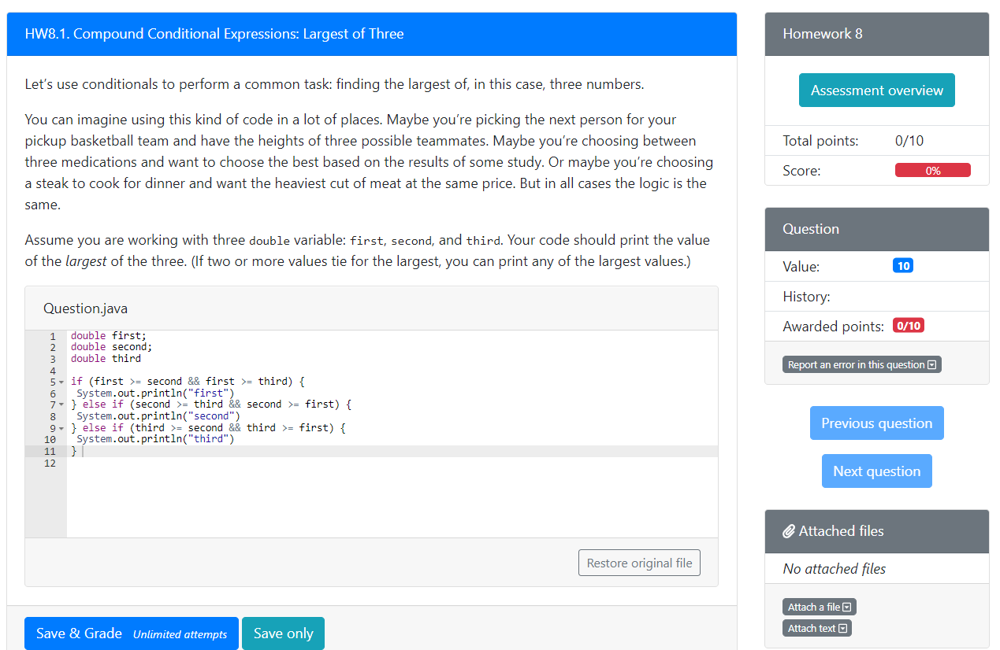
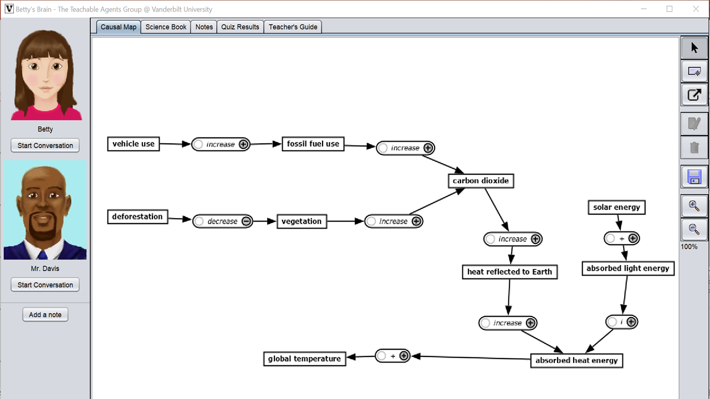

---
---
    

 Novice programmers 

  

I am participating in this project under [Dr. Luc Paquette](https://education.illinois.edu/faculty/luc-paquette){target="_blank"}'s supervision. This project aims to formalize a hybridized approach that combines knowledge elicitation approaches and machine learning to build interpretable and robust prediction models. This method will be applied to support the development of novice programmers' debugging skills. The data are from a large introductory computer science (CS1) course, hosted on PrairieLearn, a web-based problem-driven learning system. I am responsible for writing codes to extract relevant features from students' submissions to programming questions, assisting Dr. Paquette in conducting interviews to elicitating experts' (e.g., instructors and TAs) knowledge about novices' debugging behaviors, and building the prediction model. 
      

***

 Self-regulated Learning and Affect 

  

I participated in this project under the supervision of Dr. Luc Paquette. It investigates the link between affect and self-regulated learning in the context of [Betty’s Brain](https://wp0.vanderbilt.edu/oele/bettys-brain/){target="_blank"}, a computer-based science learning environment. One study that I have conducted examined the association between confusion and metacognitive strategies (MS), skills for regulating cognition. Another research I did is about the role of difficulty and familiarity feelings toward the task in Betty’s Brain. Knowing how these feelings influence learning behaviors may help us design more personalized intervention for students. Overall, I hope to obtain deeper understanding about the interaction between affect and strategic learning behavior in digital learning environments.
    

***

 Response Styles

   This project is my master thesis.
Response styles refer to the tendency to select specific categories of a rating
scale. The most common types of response styles include acquiescence response style, disacquiescence response style, extreme response style and midpoint response style (see the picture in the right). They can cause subjects’ response to rating scales biased. My thesis investigated how the extreme response style might influence the statistical analyses and compared methods for controlling its undesirable impact.
    

***

 Assessment for Child-Friendly Schools in rural China

  

    
The Assessment of Children’s Learning and
Development in [Child-Friendly Schools](https://www.unicef.org/infobycountry/china_37818.html){target="_blank"}, which is sponsored by the United Nations Children’s Fund, aims to evaluate the effectiveness of Child-Friendly Schools program. I participated the first round of evaluation, undertaking most of the work related to data analysis, such as exploring the factors related to students’ academic performance through hierarchical linear models and linking students’ achievement test scores to a national scale via test equating techniques.        
